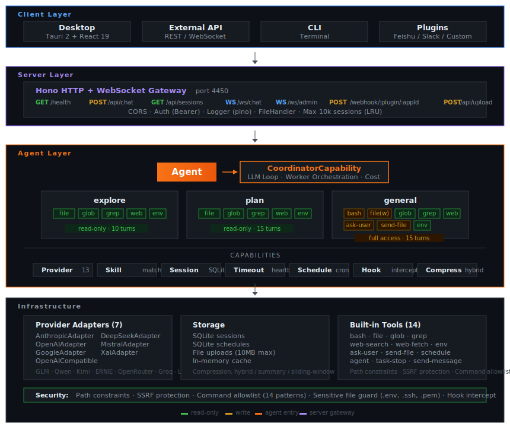

<div align="center">
  <p>
     <span style="font-size: 2em; font-weight: bold; vertical-align: middle;">Hive</span>
  </p>

  <p><strong>The Multi-Agent SDK for TypeScript</strong></p>
  <p>Coordinator-Worker architecture with built-in cost control, permission layers, and Chinese LLM support.</p>

  <p>
    <a href="#quick-start">Quick Start</a> &middot;
    <a href="#architecture">Architecture</a> &middot;
    <a href="#api-reference">API</a> &middot;
    <a href="#providers">Providers</a> &middot;
    <a href="#faq">FAQ</a>
  </p>

  <p>
    <code>npm i @bundy-lmw/hive-core</code>
  </p>

  <p>
    
    
    
    
  </p>

  <p><a href="./README.zh-CN.md">中文文档</a></p>
</div>

---

## Why Hive

| Problem | Hive Approach |
|:--------|:-------------|
| Agent loops burn tokens on simple queries | Coordinator-Worker pattern — only spawn workers when needed |
| Expensive models used for everything | Provider presets with per-task model selection via `DispatchOptions.modelId` |
| Read-only operations can mutate files | Worker agents have enforced tool permissions (explore/plan = read-only, general = full access) |
| Chinese LLMs need manual parameter hacking | 13 built-in provider adapters (GLM, DeepSeek, Qwen, Kimi, ERNIE, Claude, GPT, Gemini, etc.) |
| Long-running agents go silent | Built-in heartbeat, stall detection, and abort signals |

---

## Quick Start

### Install

```bash
npm i @bundy-lmw/hive-core
```

### Configure

```bash
export GLM_API_KEY=your-key
# or: DEEPSEEK_API_KEY, ANTHROPIC_API_KEY, OPENAI_API_KEY
```

### Dispatch

```typescript
import { Agent } from '@bundy-lmw/hive-core';

const agent = new Agent();
const result = await agent.dispatch('Refactor the login module');
// Coordinator spawns explore → plan → general workers automatically

console.log(result.text);    // Final output
console.log(result.usage);   // { input: 1234, output: 567 }
console.log(result.tools);   // ['glob', 'file', 'bash']
console.log(result.duration); // ms
```

### Event Stream

```typescript
const result = await agent.dispatch('Analyze the auth flow', {
  onPhase: (phase, msg) => console.log(`[${phase}] ${msg}`),
  onText: (text) => process.stdout.write(text),
  onTool: (tool, input) => console.log(`→ ${tool}`),
  onToolResult: (tool, result) => console.log(`← ${tool}`),
  onReasoning: (thought) => console.log(`[reasoning] ${thought}`),
  abortSignal: controller.signal,
});
```

### HTTP Server

```bash
pnpm --filter @bundy-lmw/hive-server start
# POST http://localhost:4450/api/chat
# WS   ws://localhost:4450/ws/chat
```

---

<!-- TODO: Add workflow demo GIF here -->

---

## Architecture

Hive uses a **Coordinator-Worker** pattern. The `Agent` class is the single entry point. `dispatch()` delegates to `CoordinatorCapability`, which manages the LLM loop and spawns specialized **worker agents** as tools.

<div align="center">
  
</div>

### Worker Agent Tool Permissions

| Tool | explore | plan | general | schedule |
|:-----|:--------|:-----|:--------|:---------|
| `file` (read) | ✅ | ✅ | ✅ | — |
| `glob` | ✅ | ✅ | ✅ | — |
| `grep` | ✅ | ✅ | ✅ | — |
| `web-search` | ✅ | ✅ | ✅ | — |
| `web-fetch` | ✅ | ✅ | ✅ | — |
| `env` | ✅ | ✅ | ✅ | — |
| `bash` | — | — | ✅ | — |
| `file` (write) | — | — | ✅ | — |
| `ask-user` | — | — | ✅ | — |
| `send-file` | — | — | ✅ | — |
| `schedule` | — | — | — | ✅ |

### Capabilities

<div align="center">

<table style="border:none; margin: 0 auto;">
<tr style="border:none;">
  <td style="border:none; padding:4px 6px;"><code style="background:#f3f4f6; padding:4px 10px; border-radius:0; font-size:12px; border:1px solid #e5e7eb;">Coordinator</code></td>
  <td style="border:none; padding:4px 0; color:#9ca3af; font-size:12px;">dispatch · worker orchestration · cost</td>
</tr>
<tr style="border:none;">
  <td style="border:none; padding:4px 6px;"><code style="background:#f3f4f6; padding:4px 10px; border-radius:0; font-size:12px; border:1px solid #e5e7eb;">Provider</code></td>
  <td style="border:none; padding:4px 0; color:#9ca3af; font-size:12px;">registry · switching · AI SDK</td>
</tr>
<tr style="border:none;">
  <td style="border:none; padding:4px 6px;"><code style="background:#f3f4f6; padding:4px 10px; border-radius:0; font-size:12px; border:1px solid #e5e7eb;">Skill</code></td>
  <td style="border:none; padding:4px 0; color:#9ca3af; font-size:12px;">loading · matching · instruction generation</td>
</tr>
<tr style="border:none;">
  <td style="border:none; padding:4px 6px;"><code style="background:#f3f4f6; padding:4px 10px; border-radius:0; font-size:12px; border:1px solid #e5e7eb;">Session</code></td>
  <td style="border:none; padding:4px 0; color:#9ca3af; font-size:12px;">SQLite persistence · multi-session</td>
</tr>
<tr style="border:none;">
  <td style="border:none; padding:4px 6px;"><code style="background:#f3f4f6; padding:4px 10px; border-radius:0; font-size:12px; border:1px solid #e5e7eb;">Timeout</code></td>
  <td style="border:none; padding:4px 0; color:#9ca3af; font-size:12px;">heartbeat · stall detection · abort</td>
</tr>
<tr style="border:none;">
  <td style="border:none; padding:4px 6px;"><code style="background:#f3f4f6; padding:4px 10px; border-radius:0; font-size:12px; border:1px solid #e5e7eb;">Schedule</code></td>
  <td style="border:none; padding:4px 0; color:#9ca3af; font-size:12px;">cron · task lifecycle</td>
</tr>
</table>

</div>

### Server (`@bundy-lmw/hive-server`)

Hono HTTP + WebSocket server wrapping the Agent SDK:

| Route | Method | Description |
|:------|:-------|:------------|
| `/health` | GET | Health check |
| `/api/chat` | POST | Chat endpoint |
| `/api/sessions` | GET | List sessions |
| `/api/sessions/:id` | GET/DELETE | Session CRUD |
| `/ws/chat` | WS | Chat streaming |
| `/ws/admin` | WS | Admin panel |
| `/webhook/:plugin/:appId` | POST | Plugin webhooks |

---

## API Reference

### Agent

```typescript
import { Agent } from '@bundy-lmw/hive-core';

const agent = new Agent(options?);
await agent.initialize();

// Task execution
const result = await agent.dispatch(task: string, options?: DispatchOptions): Promise<DispatchResult>;

// Provider management
agent.useProvider(name: string, apiKey?: string): boolean;
agent.listProviders(): ProviderConfig[];
agent.listAllProviders(): Promise<ModelsDevProvider[]>;
agent.listProviderModels(providerId: string): Promise<ModelSpec[]>;

// Skill management
agent.listSkills(): Skill[];
agent.matchSkill(input: string): SkillMatchResult | null;
agent.registerSkill(skill: Skill): void;

// Session management
await agent.createSession(config?): Promise<Session>;
await agent.loadSession(sessionId: string): Promise<Session | null>;
agent.getSessionMessages(): Message[];

// Lifecycle
await agent.dispose();
```

### DispatchOptions

```typescript
interface DispatchOptions {
  chatId?: string;
  cwd?: string;
  maxTurns?: number;
  modelId?: string;           // Override model for this task
  systemPrompt?: string;
  abortSignal?: AbortSignal;  // Cancel mid-execution
  onPhase?(phase: string, message: string): void;
  onText?(text: string): void;
  onTool?(tool: string, input?: unknown): void;
  onToolResult?(tool: string, result: unknown): void;
  onReasoning?(text: string): void;
}
```

### DispatchResult

```typescript
interface DispatchResult {
  text: string;
  success: boolean;
  duration: number;            // ms
  tools: string[];             // tools used
  usage?: { input: number; output: number };
  cost?: { input: number; output: number; total: number };
  steps?: StepResult[];
  error?: string;
}
```

---

## Providers

### Built-in Adapters

| Adapter | Providers | Protocol |
|:--------|:---------|:---------|
| `AnthropicAdapter` | Claude (opus, sonnet, haiku) | Anthropic API |
| `OpenAIAdapter` | GPT-4o, GPT-4-turbo | OpenAI API |
| `GoogleAdapter` | Gemini | Google AI |
| `OpenAICompatibleAdapter` | GLM, DeepSeek, Qwen, Kimi, ERNIE, OpenRouter, Groq, xAI, Mistral, LiteLLM | OpenAI-compatible |

13 providers out of the box. Any OpenAI-compatible endpoint works with `baseUrl` + `apiKey` — no source changes needed.

### Chinese LLM Presets

| Provider | Model Examples | Notes |
|:---------|:--------------|:------|
| GLM (Zhipu) | glm-5, glm-4.7 | Long context, multimodal |
| Qwen (Alibaba) | qwen3-max, qwen-plus | Alibaba Cloud |
| DeepSeek | deepseek-chat, deepseek-reasoner | Cost-effective |
| Kimi (Moonshot) | moonshot-v1-128k | Ultra-long context |
| ERNIE (Baidu) | ernie-4.0-8k | Baidu |

---

## Hook System

Intercept any lifecycle event with priority-based hooks:

```typescript
agent.context.hookRegistry.on('tool:before', async (ctx) => {
  if (ctx.toolName === 'bash') {
    return { proceed: false, error: 'bash is blocked in this environment' };
  }
}, { priority: 'highest' });
```

### Available Hooks

| Hook | Trigger |
|:-----|:--------|
| `session:start` / `end` / `error` | Session lifecycle |
| `tool:before` / `after` | Tool execution (can block) |
| `provider:beforeChange` / `afterChange` | Provider switching |
| `timeout:stalled` / `health:heartbeat` | Health monitoring |
| `agent:thinking` / `task:progress` | Agent introspection |
| `notification:push` | Channel notifications |

---

<details>
<summary><b>Project Structure</b></summary>

```
hive/
├── packages/core/src/
│   ├── agents/
│   │   ├── core/
│   │   │   ├── Agent.ts              # Single entry point
│   │   │   ├── AgentContext.ts        # Shared context + hook registry
│   │   │   ├── agents.ts             # Worker definitions (explore/plan/general/schedule)
│   │   │   └── runner.ts             # AgentRunner — worker execution engine
│   │   └── capabilities/
│   │       ├── CoordinatorCapability.ts  # LLM loop + worker orchestration
│   │       ├── ProviderCapability.ts     # Provider registry + AI SDK
│   │       ├── SkillCapability.ts        # Skill loading + matching
│   │       ├── SessionCapability.ts      # SQLite persistence
│   │       ├── TimeoutCapability.ts      # Heartbeat + stall detection
│   │       └── ScheduleCapability.ts     # Cron scheduling
│   ├── providers/
│   │   ├── ProviderManager.ts        # Provider registry
│   │   └── adapters/                 # Anthropic, OpenAI, Google, OpenAI-compatible
│   ├── tools/built-in/               # 14 tools (bash, file, glob, grep, web, etc.)
│   ├── skills/                       # SkillLoader, SkillMatcher, SkillRegistry
│   ├── hooks/                        # HookRegistry + types
│   └── index.ts                      # Public API exports
├── apps/server/src/
│   ├── main.ts                       # Server entry
│   └── gateway/                      # Hono HTTP + WebSocket routes
└── apps/desktop/                     # Tauri 2 desktop app (React 19)
```

</details>

---

## Development

| Command | Description |
|:--------|:------------|
| `pnpm install` | Install dependencies |
| `pnpm -r build` | Build all packages |
| `pnpm test` | Run tests (1,337 cases) |
| `pnpm test:e2e` | E2E tests (requires API key) |
| `pnpm --filter @bundy-lmw/hive-server start` | Start HTTP server |

---

## FAQ

<details>
<summary><b>How does the Coordinator-Worker pattern work?</b></summary>

`Agent.dispatch()` enters a Coordinator LLM loop. The Coordinator has 3 coordinator tools — `agent` (spawn worker), `task-stop` (cancel workers), and `send-message` (push to channels). For complex tasks, it autonomously spawns explore → plan → general workers. For simple queries, it responds directly without spawning any workers.

</details>

<details>
<summary><b>How do I integrate into an existing project?</b></summary>

Install `@bundy-lmw/hive-core`, set env vars or pass `AgentInitOptions`, call `agent.dispatch()`. For an HTTP wrapper, use `@bundy-lmw/hive-server`.

</details>

<details>
<summary><b>How do I add a custom channel?</b></summary>

Implement the Plugin interface, publish as an npm package, and register via webhook route. See `@bundy-lmw/hive-plugin-feishu` as a reference.

</details>

<details>
<summary><b>Can I use multiple providers simultaneously?</b></summary>

Yes. Configure multiple providers and switch at runtime with `agent.useProvider('name')`. Override per-task with `dispatch(task, { modelId: 'deepseek-chat' })`.

</details>

---

## License

[MIT](LICENSE)

---

<p align="center">
  <a href="https://github.com/1695365384/hive/issues">Issues</a> &middot;
  <a href="https://github.com/1695365384/hive/pulls">Pull Requests</a> &middot;
  <a href="https://github.com/1695365384/hive/blob/main/CONTRIBUTING.md">Contributing</a>
</p>
